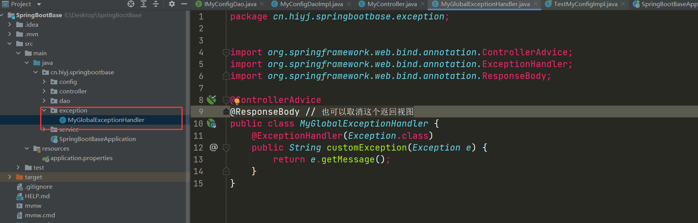

# SpringBoot基础知识

## IDEA创建maven项目

- 1. 创建Spring Initializr项目，并定义项目名、包名，无脑下一步

    

- 2. 创建加载完成后，项目文件夹结构示例（需要处理依赖，可能加载较慢）

    

## 基础注解及示例

1. `@Autowired`自动注入
    - 1. 右键`cn.hiyj.springbootbase`新建类，类名`config.MyConfig`

        

        

    - 2. 添加相关定义

        ```java
        package cn.hiyj.springbootbase.config;

        @SpringBootConfiguration // 添加配置类注解，将此类交给Spring容器进行管理，表示将此类标记为Spring容器中的一个Bean
        public class MyConfig {
            private int pid = 110;
            private String password = "5201314";

            public int getPid() {
                return pid;
            }

            public void setPid(int pid) {
                this.pid = pid;
            }

            public String getPassword() {
                return password;
            }

            public void setPassword(String password) {
                this.password = password;
            }

            @Override
            public String toString() {
                return "{" +
                        "pid=" + pid +
                        ", password='" + password + '\'' +
                        '}';
            }
        }
        ```

    - 3. 添加测试代码，测试是否能自动注入
        - 1.添加测试类`config.TestMyConfig`
        - 2. 添加相关测试代码

            ```java
            package cn.hiyj.springbootbase.config;

            import org.junit.jupiter.api.Test;
            import org.springframework.beans.factory.annotation.Autowired;
            import org.springframework.boot.test.context.SpringBootTest;

            @SpringBootTest //SpringBoot测试类注解
            public class TestMyConfig {
                @Autowired //自动注入
                private MyConfig myConfig;

                @Test
                public void testMyConfig() {
                    // 如果注入失败会报空指针
                    System.out.println(myConfig.toString());
                }
            }
            ```

            

        - 3. 运行`testMyConfig()`进行测试

            

2. `@Component` 标注Spring管理的Bean，使用@Component注解在一个类上，表示将此类标记为Spring容器中的一个Bean

    - 1. 例如有一个类，无法给与他很合适的分类，但是需要使用Spring容器进行管理，则可以使用该注解，例如类`cn.hiyj.springbootbase.service.MyConfigService`;

        ```java
        package cn.hiyj.springbootbase.service;

        import cn.hiyj.springbootbase.config.MyConfig;
        import org.springframework.beans.factory.annotation.Autowired;
        import org.springframework.stereotype.Component;

        @Component("myConfigService")
        public class MyConfigService {
            @Autowired
            private MyConfig myConfig;

            public void printMyConfig() {
                System.out.println(myConfig.toString());
            }
        }
        ```

        
    - 2. 该类通过`@Component("myConfigService")`添加为Spring容器管理的`Bean`，`@Component(value)`,当使用该注解时,SpringIOC会将这个类自动扫描成一个bean实例 不写的时候,默认是类名,且首字母小写

    - 3. 编写测试类`cn.hiyj.springbootbase.service.TestMyConfigService`测试自动注入该类，

        ```java
        package cn.hiyj.springbootbase.service;

        import org.junit.jupiter.api.Test;
        import org.springframework.beans.factory.annotation.Autowired;
        import org.springframework.boot.test.context.SpringBootTest;

        @SpringBootTest
        public class TestMyConfigService {
            @Autowired
            private MyConfigService myConfigService;

            @Test
            public void testPrintMyConfigService() {
                myConfigService.printMyConfig();
            }
        }

        ```

        

    - 4. 运行`testPrintMyConfigService()`进行测试

        

3. `@Repository`用在持久层的接口上，这个注解是将接口的一个实现类交给spring管理。
    - 1. 创建接口`cn.hiyj.springbootbase.dao.inter.IMyConfigDao`与其实现`cn.hiyj.springbootbase.dao.impl.MyConfigDaoImpl`

        

    - 2. 添加代码
        - 1. `cn.hiyj.springbootbase.dao.inter.IMyConfigDao`

            ```java
                package cn.hiyj.springbootbase.dao.inter;

                import org.springframework.stereotype.Repository;


                @Repository(value="myConfigDao")
                public interface IMyConfigDao {
                    void printMyConfig();
                }
            ```

        - 2. `cn.hiyj.springbootbase.dao.impl.MyConfigDaoImpl`

            ```java
            package cn.hiyj.springbootbase.dao.impl;

            import cn.hiyj.springbootbase.config.MyConfig;
            import cn.hiyj.springbootbase.dao.inter.IMyConfigDao;
            import org.springframework.beans.factory.annotation.Autowired;
            import org.springframework.stereotype.Repository;

            @Repository
            public class MyConfigDaoImpl implements IMyConfigDao {

                @Autowired
                private MyConfig myConfig;

                @Override
                public void printMyConfig() {
                    System.out.println(myConfig.toString());
                }
            }

            ```

    - 3. 编写测试类，并运行测试

        ```java
        package cn.hiyj.springbootbase.dao;

        import cn.hiyj.springbootbase.dao.inter.IMyConfigDao;
        import org.junit.jupiter.api.Test;
        import org.springframework.beans.factory.annotation.Autowired;
        import org.springframework.boot.test.context.SpringBootTest;

        @SpringBootTest
        public class TestMyConfigImpl {

            @Autowired
            private IMyConfigDao myConfigDao;

            @Test
            public void testPrintMyConfig(){
                myConfigDao.printMyConfig();
            }
        }
        ```

        

        

4. `@Service`一般注解在service层的类上

    *用法与`@Repository`类似*

5. `@Controller`与`@RequestMapping`
    - 1. `@Controller`标记一个类是Controller，SpringBoot会扫描类中`@RequestMapping`注解映射的方法，`@Controller`只是定义了一个控制器类，而使用`@RequestMapping`注解的方法才是真正处理请求的处理器

    - 2. 定义控制类`cn.hiyj.springbootbase.controller.MyController`

        ```java
        package cn.hiyj.springbootbase.controller;

        import org.springframework.stereotype.Controller;
        import org.springframework.web.bind.annotation.RequestMapping;
        import org.springframework.web.bind.annotation.RequestParam;
        import org.springframework.web.bind.annotation.ResponseBody;

        @Controller
        @RequestMapping(value = "/say") // 需要添加依赖，IDEA可推荐，选择添加就行
        public class MyController {

            @ResponseBody //注明此方法返回的是字符串，不是视图，添加到类上则本类全部返回数据，不是视图
            @RequestMapping("hello") // 相对于类的路径
            public String sayHello(@RequestParam/*请求参数注入*/ String name) {
                return "Hello!" + name;
            }
        }
        ```

        

    - 3. 运行整个项目

        

    - 4. 浏览器测试`http://127.0.0.1:/say/hello/'name?=123`，默认8080端口

         

6. 全局异常处理`@ControllerAdvice`
    - 1. 创建类`cn.hiyj.springbootbase.exception.MyGlobalExceptionHandler`

        ```java
        @ControllerAdvice
        @ResponseBody // 也可以取消这个返回视图
        public class MyGlobalExceptionHandler {
            @ExceptionHandler(Exception.class) // 对应的异常类
            // 出现异常后执行的函数
            public ModelAndView customException(Exception e) {
                ModelAndView mv = new ModelAndView();
                mv.addObject("message", e.getMessage());
                mv.setViewName("myerror");
                return mv;
            }
        }
        ```

        

    - 2. 控制层`MyController`增加测试异常

        ```java
        package cn.hiyj.springbootbase.controller;

        import org.springframework.stereotype.Controller;
        import org.springframework.web.bind.annotation.RequestMapping;
        import org.springframework.web.bind.annotation.RequestParam;
        import org.springframework.web.bind.annotation.ResponseBody;

        @Controller
        @RequestMapping(value = "/say") // 需要添加依赖，IDEA可推荐，选择添加就行
        public class MyController {

            // *** 另一个函数此处省略

            @ResponseBody
            @RequestMapping(value = "exception")
            public String exception() throws Exception {
                throw new Exception("出现异常");
            }
        }

        ```

    - 3. 启动项目主类
    - 4. 浏览器测试

        

7. `@RestControllerAdvice`与`@ControllerAdvice`类似

## 扩展

1. Lombok
    - 1. maven依赖：

        ```xml
        <dependency>
            <groupId>org.projectlombok</groupId>
            <artifactId>lombok</artifactId>
            <version>1.16.6</version>
        </dependency>
        ```

    - 2. @Data：注解在类上；提供类所有属性的 getting 和 setting 方法，此外还提供了equals、canEqual、hashCode、toString 方法
    - 3. @Setter：注解在属性上；为属性提供 setting 方法
    - 4. @Getter：注解在属性上；为属性提供 getting 方法
